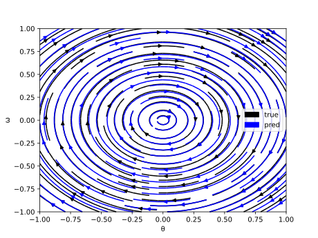
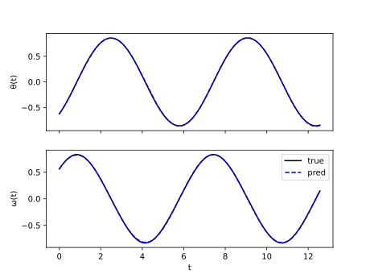

# Constructing Neural Network-Based Models for Simulating Dynamical Systems

This is a companion repo for the review paper **Constructing Neural Network-Based Models for Simulating Dynamical Systems** which provides a practical description on how models like *Neural Ordinary Differential Equations* and *Physics-informed Neural Networks* can be implemented.
The full paper can be accessed at: https://dl.acm.org/doi/10.1145/3567591

The code in the repo is implemented in Python using PyTorch for defining and training the models.
The scripts can be run using default parameters to reproduce the plots seen in the paper, as well as things like loss curves which were cut due to space requirements:




# Installing dependencies

The dependencies necessary to run the scripts can be installed through pip using the `requirements.txt` file as follows:
``` bash
python3 -m pip install -r requirements.txt
```
In case you are using Conda you can run the following command from a fresh environment:
``` bash
conda install --file requirements.txt
```

# Running the experiments

Each experiment can be run using default parameters by executing the script in the python interpreter as follows:
```
python3 experiments/<name of experiment>.py ...
```
The table below contains the commands necessary to train and evaluate the models described in the review paper.

| Name                                         | Section | Command                                                         |
| -------------------------------------------- | ------- | --------------------------------------------------------------- |
| Vanilla Direct-Solution                      | 3.2     | python3 experiments/direct_solution.py --model vanilla          |
| Automatic Differentiation in Direct-Solution | 3.3     | python3 experiments/direct_solution.py --model autodiff         |
| Physics Informed Neural Networks             | 3.4     | python3 experiments/direct_solution.py --model pinn             |
| Hidden Physics Networks                      | 3.5     | python3 experiments/hidden_physics.py                           |
| Direct Time-Stepper                          | 4.2.1   | python3 experiments/time_stepper.py --solver direct             |
| Residual Time-Stepper                        | 4.2.2   | python3 experiments/time_stepper.py --solver resnet             |
| Euler Time-Stepper                           | 4.2.3   | python3 experiments/time_stepper.py --solver euler              |
| Neural ODEs Time-Stepper                     | 4.2.4   | python3 experiments/time_stepper.py --solver {rk4,dopri5,tsit5} |
| Neural State-Space Model                     | 4.3.1   | ...                                                             |
| Neural ODEs with input                       | 4.3.2-3 | ...                                                             |
| Lagrangian Time-Stepper                      | 4.4.1   | ...                                                             |
| Hamiltonian Time-Stepper                     | 4.4.1   | ...                                                             |
| Deep Potential Time-Stepper                  | 4.4.2   | ...                                                             |
| Deep Markov-Model                            | 4.5.1   | ...                                                             |
| Latent Neural ODEs                           | 4.5.2   | python3 experiments/latent_neural_odes.py                       |
| Bayesian Neural ODEs                         | 4.5.3   | ...                                                             |
| Neural SDEs                                  | 4.5.4   | ...                                                             |


# Docker Image
In an effort to ensure that the code can be executed in the future, we provide a docker image.
The Docker image allows the code to be run in a Linux based virtual machine on any platform supported by Docker.

To use the docker image, invoke the build command in the root of this repository:
``` bash
docker build . -t python_dynamical_systems
```

Following this "containers" containing the code and all dependencies can be instantiated via the "run" command:
``` bash
docker run -ti python_dynamical_systems bash
```
The command will establish an interactive connection to the container.
Following this you can execute the code as if it was running on your host machine:
``` bash
python3 experiments/time_stepper.py ...
```

# Citing the paper

If you use the work please consider citing it:
``` bibtex
@article{10.1145/3567591,
author = {Legaard, Christian and Schranz, Thomas and Schweiger, Gerald and Drgo\v{n}a, J\'{a}n and Falay, Basak and Gomes, Cl\'{a}udio and Iosifidis, Alexandros and Abkar, Mahdi and Larsen, Peter},
title = {Constructing Neural Network Based Models for Simulating Dynamical Systems},
year = {2023},
issue_date = {November 2023},
publisher = {Association for Computing Machinery},
address = {New York, NY, USA},
volume = {55},
number = {11},
issn = {0360-0300},
url = {https://doi.org/10.1145/3567591},
doi = {10.1145/3567591},
abstract = {Dynamical systems see widespread use in natural sciences like physics, biology, and chemistry, as well as engineering disciplines such as circuit analysis, computational fluid dynamics, and control. For simple systems, the differential equations governing the dynamics can be derived by applying fundamental physical laws. However, for more complex systems, this approach becomes exceedingly difficult. Data-driven modeling is an alternative paradigm that seeks to learn an approximation of the dynamics of a system using observations of the true system. In recent years, there has been an increased interest in applying data-driven modeling techniques to solve a wide range of problems in physics and engineering. This article provides a survey of the different ways to construct models of dynamical systems using neural networks. In addition to the basic overview, we review the related literature and outline the most significant challenges from numerical simulations that this modeling paradigm must overcome. Based on the reviewed literature and identified challenges, we provide a discussion on promising research areas.},
journal = {ACM Comput. Surv.},
month = {feb},
articleno = {236},
numpages = {34},
keywords = {physics-informed neural networks, physics-based regularization, Neural ODEs}
}
```
