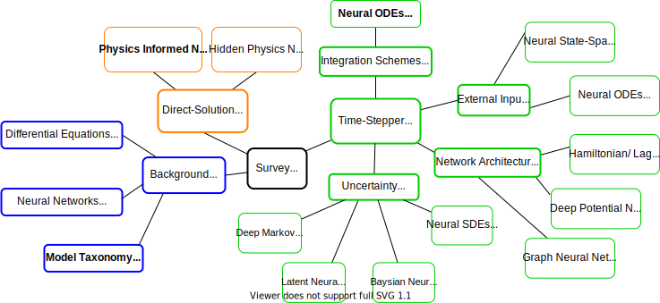

This is a companion repo for the review paper **Constructing Neural Network-Based Models for Simulating Dynamical Systems**.
The goal is to provide PyTorch implementations that can be used as a starting point for implementation for other applications.

If you use the work please cite it using:
``` bibtex
{
    TODO add bibtex key
}
```


# Installing dependencies

``` bash
python3 -m pip install -r requirements.txt
```

# Where are the models located?

The table below contains the commands necessary to train and evaluate the models described in the review paper.
Each experiment can be run using default parameters by executing the script in the python interpreter as follows:
```
python3 experiments/<name of experiment>.py ...
```


| Name                                         | Section | Command                                                         |
| -------------------------------------------- | ------- | --------------------------------------------------------------- |
| Vanilla Direct-Solution                      | 3.2     | python3 experiments/direct_solution.py --model vanilla          |
| Automatic Differentiation in Direct-Solution | 3.3     | python3 experiments/direct_solution.py --model autodiff         |
| Physics Informed Neural Networks             | 3.4     | python3 experiments/direct_solution.py --model pinn             |
| Hidden Physics Networks                      | 3.5     | python3 experiments/direct_solution.py --model hnn              |
| Direct Time-Stepper                          | 4.2.1   | python3 experiments/time_stepper.py --solver direct             |
| Residual Time-Stepper                        | 4.2.2   | python3 experiments/time_stepper.py --solver resnet             |
| Euler Time-Stepper                           | 4.2.3   | python3 experiments/time_stepper.py --solver euler              |
| Neural ODEs Time-Stepper                     | 4.2.4   | python3 experiments/time_stepper.py --solver {rk4,dopri5,tsit5} |
| Neural State-Space Model                     | 4.3.1   | ...                                                             |
| Neural ODEs with input                       | 4.3.2-3 | ...                                                             |
| Lagrangian Time-Stepper                      | 4.4.1   | ...                                                             |
| Hamiltonian Time-Stepper                     | 4.4.1   | ...                                                             |
| Deep Potential Time-Stepper                  | 4.4.2   | ...                                                             |
| Deep Markov-Model                            | 4.5.1   | ...                                                             |
| Latent Neural ODEs                           | 4.5.2   | python3 experiments/latent_neural_odes.py                       |
| Bayesian Neural ODEs                         | 4.5.3   | ...                                                             |
| Neural SDEs                                  | 4.5.4   | ...                                                             |


# Docker Image
In an effort to ensure that the code can be executed in the future, we provide a docker image.
The Docker image allows the code to be run in a Linux based virtual machine on any platform supported by Docker.

To use the docker image, invoke the build command in the root of this repository:
``` bash
docker build . -t python_dynamical_systems
```

Following this "containers" containing the code and all dependencies can be instantiated via the "run" command:
``` bash
docker run -ti python_dynamical_systems bash
```
The command will establish an interactive connection to the container.
Following this you can execute the code as if it was running on your host machine:
``` bash
python3 experiments/time_stepper.py ...
```
